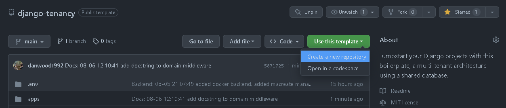
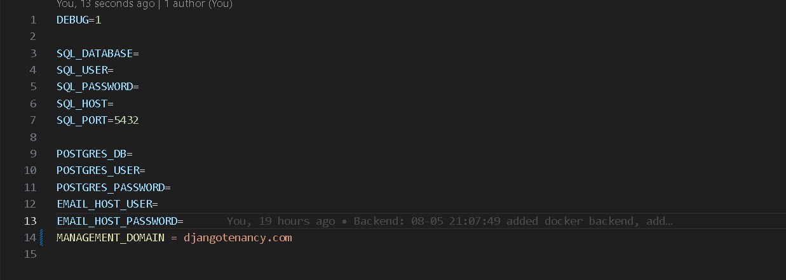
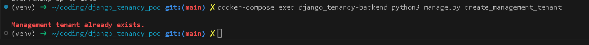

# Django django_realms Boilerplate

This is an opinionated boilerplate for a multi-tenant Django project, designed to provide a suite of robust features right out of the box. Inspired by django-tenants, this boilerplate provides domain-based tenant routing, incorporates Graphene-Django for GraphQL, and is dockerized for easy setup and deployment. It is built with both front-end and back-end components in the same project to streamline development.

## Features

* **Multi-django_realms:** Support for multiple tenants in the same Django instance, with domain-based routing.
* **Graphene-Django Integration:** Incorporates Graphene-Django for building GraphQL APIs in Python quickly and easily.
* **Dockerized:** Project components are containerized using Docker for easy setup, deployment, and distribution.
* **Unified Structure:** The front-end and back-end are integrated into the same project, making it easier to manage and develop.

## Prerequisites

You need to have Docker installed on your machine to run this project locally.

## Getting Started

1. Ensure git and Docker are installed on your machine.

2. Clone this project: ```git clone https://github.com/danwood1992/django_realms-boiler.git```

or you can create your own repo.


<hr>

3. Navigate to the `.env` folder in the project, rename the `.dev-example` to `dev` and fill in the required fields.

it will look something like this
 
<hr>

4. Navigate to the project base directory (the one containing `docker-compose.yaml`).

- Edit the docker-compose.yaml file to suit your needs, i.e change image name or add more services.

5 . Run the following commands to build the Docker images and migrate the database:

- Build the Docker images:
  ```
  docker-compose up -d --build
  ```

- Migrate the database:
  ```
  docker-compose exec <backend-service-name> python3 manage.py makemigrations
  docker-compose exec <backend-service-name> python3 manage.py migrate
  ```

- Create a management tenant (necessary before making requests to the backend)If a management tenant doesnt exist, the middleware will redirect you:

  ```
  docker-compose exec <backend-service-name> python3 manage.py create_management_tenant
  ```
  
- Here's an example of the message you'll see when trying ot execute the command if a  management tenant exists:

  
<hr>

## Folder and File structure

The folder structure is as follows:

```
├── CONTRIBUTING.MD
├── LICENSE.md
├── README.md
├── app.log
├── apps
│   ├── management
│   │   ├── __init__.py
│   │   └── tenant_management
│   │       ├── __init__.py
│   │       ├── admin.py
│   │       ├── apps.py
│   │       ├── management
│   │       │   ├── __init__.py
│   │       │   └── commands
│   │       │       ├── __init__.py
│   │       │       └── create_management_tenant.py
│   │       ├── middleware.py
│   │       ├── migrations
│   │       │   ├── 0001_initial.py
│   │       │   ├── __init__.py
│   │       ├── models.py
│   │       ├── tests.py
│   │       └── views.py
│   └── tenant
│       ├── __init__.py
│       └── seats
│           ├── __init__.py
│           ├── admin.py
│           ├── apps.py
│           ├── migrations
│           │   ├── 0001_initial.py
│           │   ├── __init__.py
│           ├── models.py
│           ├── tests.py
│           └── views.py
├── compose
│   ├── dev
│   │   ├── backend
│   │   │   ├── Dockerfile
│   │   │   ├── entrypoint
│   │   │   └── start
│   │   └── notes.txt
│   └── production
├── core
│   ├── __init__.py
│   ├── asgi.py
│   ├── settings.py
│   ├── urls.py
│   ├── views.py
│   └── wsgi.py
├── docker-compose.yml
├── docs
│   ├── create_management_tenant.png
│   └── django_realms-guide
│       └── index.html
├── html_templates
│   ├── core
│   │   ├── alerts.html
│   │   ├── base.html
│   │   ├── footer.html
│   │   └── navbar.html
│   ├── index.html
│   ├── management_index.html
│   ├── not_active.html
│   ├── not_paid.html
│   └── signup.html
├── manage.py
├── requirements.txt
└── todo.txt
```
<hr>

## Tests

Out of the box tests are simple, you should be able to run the following command to run the tests.

```docker-compose exec django_realms-backend python3 manage.py test```

Because the boiler has has a folder called 'apps', and then split between management and tenant app folders this is for seperation of concern. 

You can obviously change this to suit your needs.

Out of the box a django test command may look like this.

```docker-compose exec django_realms-backend python3 manage.py test apps.management.tenant_management.tests```

<hr>

## Authors

* **Daniel Wood** - *Initial work* - [danwood1992](https://github.com/danwood1992)

See also the list of [contributors](https://github.com/danwood1992/django_realms-boiler/contributors) who participated in this project.

<hr>

## Contributing

Contributions are always welcome! See the [CONTRIBUTING.md](CONTRIBUTING.md) file for how to contribute to this project.

<hr>

## License

This project is licensed under the MIT License - see the [LICENSE.md](LICENSE.md) file for details.

<hr>

## Acknowledgments

* [Adam Birds](https://github.com/adambirds)
